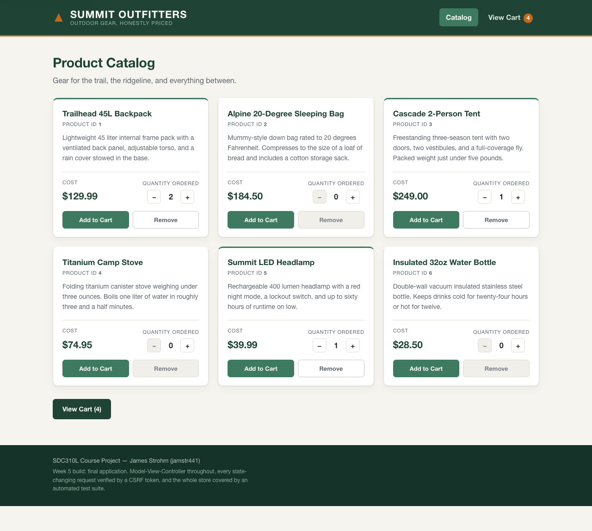
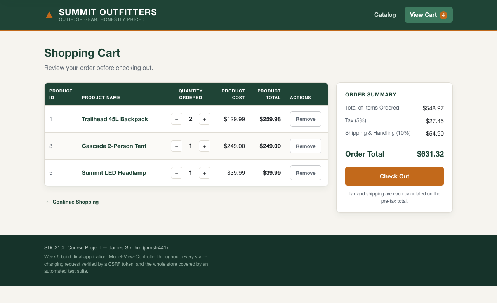
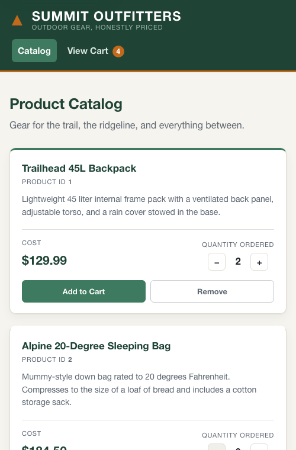

# SDC310L Course Project — Summit Outfitters Online Store

**Student:** James Strohm (jamstr441)
**Course:** SDC310L — Software Development Capstone Lab
**Term:** 08/03/2026 – 09/06/2026

A PHP online store with a product catalog and shopping cart, built
incrementally over five weeks.

## Current milestone — Week 5: Finalizing the Application

The application is complete. This week closed the last open security item,
reworked the store front, and put the whole thing under test.

**Delivered this week**

- **CSRF protection on every state-changing request.** The five cart
  mutations are POSTs, and a browser attaches this site's session cookie to a
  POST whatever page served the form — so without a token, any page on the web
  could change a visitor's cart. `Csrf` mints and compares tokens,
  `SessionCart` stores one per session, and the front controller rejects any
  POST that does not carry it. Raised as a hardening candidate in Week 3 and
  deferred through Week 4; this was the last week to do it.
- **A reworked store front.** The catalog moved from a table to a card grid —
  a table was the wrong element for a set of products being browsed, and on a
  phone it could only be made to fit by hiding every description. The cart
  keeps its table, which really is a ledger, but the order summary now sits
  beside it and follows it down the page.
- **An end-to-end test script** (`tests/e2e.sh`): 70 checks driving the real
  application over HTTP with a session cookie, covering every route, the order
  arithmetic, and every security guard.
- The PHP suite grew from 234 assertions to 266.

**Three defects found and fixed by this week's testing**

- `php tests/run.php` exited **0** when the database was down. `exit()` given
  a string prints it and exits with status 0, so the suite stopped part-way
  through, never ran three of its six files, and still reported success — the
  exact masked failure a test suite exists to prevent.
- The cart table clipped its Actions column. The two-column layout narrowed
  the table but the column widths were still the ones tuned for the full page
  width, so the Remove buttons were cut off the right edge.
- A rejected request rendered in the success styling, telling the visitor
  their action had worked when nothing had happened. Flash messages now carry
  a type.

### Request flow

```
GET /SDC310L/index.php?action=cart
  |
  index.php ......................... front controller
    |-- require core/bootstrap.php ... autoloader and helpers
    |-- Router::resolve('cart','GET') -> ['CartController','index']
    |-- new CartController($pdo)
    |     `-- index()
    |           |-- SessionCart::load() ............... Cart model
    |           |-- (new Product($pdo))->byIds($ids) .. Product model
    |           |-- $cart->lines($products)
    |           |-- Cart::totals($lines)
    |           `-- returns ['view'=>'cart/index','data'=>[...]]
    `-- View::render('cart/index', $data) -> wrapped in views/layout.php
```

| Layer | May do | May never do |
| --- | --- | --- |
| Model | Query the database, apply rules, compute money, read/write the session | Emit HTML, read `$_GET`/`$_POST`, redirect |
| Controller | Read request input, call models, choose a view or ask for a redirect | Run SQL, emit HTML, send headers |
| View | Render passed-in data, escape it | Query, mutate state, read superglobals |

### Routes

| `?action=` | Handler | Verb |
| --- | --- | --- |
| *(absent)* or `catalog` | `CatalogController::index` | GET |
| `cart` | `CartController::index` | GET |
| `cart.add` | `CartController::add` | POST |
| `cart.remove` | `CartController::remove` | POST |
| `cart.increase` | `CartController::increase` | POST |
| `cart.decrease` | `CartController::decrease` | POST |
| `cart.checkout` | `CartController::checkout` | POST |

An unknown action returns 404. A POST route reached by GET redirects to the
catalog, which is what keeps Post/Redirect/Get intact.

### How the money is handled

All currency is computed in **whole cents**. Costs come out of MySQL as exact
`DECIMAL` strings and are converted once by `Money::toCents()`, so no sequence
of additions or percentages can accumulate binary floating-point error into an
order total. Tax and shipping are each rounded to the cent independently and
the order total is the sum of the three rounded figures, which means the
printed lines always add up to the printed total.

### How cart changes are handled

Every cart change is a `POST` to a `cart.*` action. The controller updates the
session and returns a redirect, which the front controller performs as a 303
(Post/Redirect/Get). The redirect is the point: if a page handled its own POST
and rendered directly, refreshing the browser would silently re-submit and add
the product a second time.

### How forged requests are turned away

Every cart change is a POST, and a browser attaches this site's session
cookie to a POST no matter which site served the form. A page anywhere on
the web could therefore submit to this store and the visitor's cart would
change on their next visit.

The defense is a secret the attacker cannot read. `SessionCart::token()`
mints a random value once per session; every form echoes it in a hidden
field; the front controller rejects any POST whose token does not match.
Same-origin policy stops a foreign page from reading the token, so a forged
form cannot carry it.

Three details matter:

- The check sits in the front controller beside the verb check, not in the
  five `CartController` methods. It is request plumbing, and one choke point
  cannot be forgotten by a route added later.
- `Csrf::matches()` rejects an empty expected token outright rather than
  comparing it. Otherwise a request carrying no token would pass against a
  session holding no token — two empty strings are equal.
- The comparison is `hash_equals`, not `===`. A plain comparison returns as
  soon as two bytes differ, and that timing difference is enough, over many
  requests, to reconstruct the token one byte at a time.

The token is stable for the life of the session rather than rotated per
request. Rotating it would invalidate every form already rendered in the
visitor's browser, so a back button or a second open tab would have its next
click rejected as a forgery.

## Repository layout

```
index.php                      Front controller — the only entry point
config/database.php            PDO connection

core/bootstrap.php             Autoloader and helper loading
core/Router.php                Route table and resolution
core/View.php                  Template rendering
core/helpers.php               e(), url(), csrf_input(), redirect_to()

controllers/CatalogController.php
controllers/CartController.php

models/Product.php             Product database access
models/Cart.php                Cart rules and order totals
models/Money.php               Cents conversion and formatting
models/SessionCart.php         Session storage (cart, flash, CSRF token)
models/Csrf.php                CSRF token minting and comparison

views/layout.php               Document shell, header, navigation, footer
views/catalog/index.php        Catalog product cards
views/cart/index.php           Cart table and order summary
views/error/not-found.php      404 body

css/style.css                  Store look and feel
database/onlinestore.sql       Database schema and seed data
tests/                         PHP suite (php tests/run.php) and
                               end-to-end HTTP script (tests/e2e.sh)
docs/                          Screenshots, project plan, design spec and plan
```

There is no Composer. Classes are autoloaded from `models/`, `controllers/`,
and `core/` by a single `spl_autoload_register` callback in
`core/bootstrap.php` — the project is graded on a stock XAMPP install, and a
dependency manager for nine classes is not a trade worth making.

## Running the tests

There are two suites, and both must pass.

**The PHP suite** — 266 assertions over the models, the router, the view
helpers, and session storage:

```
/Applications/XAMPP/xamppfiles/bin/php tests/run.php
```

**The end-to-end script** — 70 checks driving the running application over
HTTP with a cookie jar, so the session cart persists between requests exactly
as it does in a browser:

```
tests/e2e.sh [base-url]        # default http://localhost/SDC310L
```

Both exit 0 when everything passes and non-zero otherwise, and both print
what they expected against what they got. Both need the `onlinestore`
database imported; the end-to-end script also needs the store served by
Apache.

The escaping check in the end-to-end script inserts a product whose name is a
script tag, renders the catalog, and removes it again, so the assertion runs
against the real render path rather than against `e()` in isolation.

## Running it locally

Requires XAMPP (Apache + PHP 8 + MariaDB) or any equivalent PHP 8 stack.

1. **Create the database.** Either import `database/onlinestore.sql` through
   phpMyAdmin, or from a terminal:

   ```
   /Applications/XAMPP/xamppfiles/bin/mysql -u root < database/onlinestore.sql
   ```

   The script is re-runnable — importing it twice gives the same result as
   importing it once.

2. **Serve the files.** Place this repository inside the web root — on a
   default macOS XAMPP install that is
   `/Applications/XAMPP/xamppfiles/htdocs/SDC310L`.

   Symlinking into `htdocs` from a home directory does *not* work on macOS:
   Apache runs as the `daemon` user and cannot traverse a home folder whose
   permissions are owner-only, so the request fails with
   `AH00037: Symbolic link not allowed or link target not accessible` in the
   Apache error log. Put the working copy in `htdocs` and symlink the other
   way if you want it visible elsewhere.

3. **Open the store** at <http://localhost/SDC310L/>.

## Database schema

Table `products`:

| Column                | Type          | Notes                       |
| --------------------- | ------------- | --------------------------- |
| `product_id`          | INT           | Primary key, auto-increment |
| `product_name`        | VARCHAR(100)  | Not null                    |
| `product_description` | TEXT          |                             |
| `product_cost`        | DECIMAL(10,2) | Not null                    |

`product_cost` is `DECIMAL` rather than a float so currency values carry no
binary rounding error into the tax and shipping calculations. Quantity ordered
is not stored here — it is per-user, per-session state and lives in the PHP
session.

The schema is unchanged since Week 2. Neither the Week 4 re-architecture nor
the Week 5 finalization added, dropped, or altered a table, column, type, or
constraint — the CSRF token added this week is per-visitor session state, not
stored data — and the seed rows are untouched. `database/onlinestore.sql`
therefore remains the current export, and no re-export was needed.

That was verified rather than assumed: the checked-in script was imported
into a scratch database and both `SHOW CREATE TABLE` and the full row set were
diffed against the live one. Both are identical.

## Project schedule

| Week | Focus                                     | Tag      |
| ---- | ----------------------------------------- | -------- |
| 1    | Project plan                              | —        |
| 2    | Database and application framework        | `Phase2` |
| 3    | Accessing the database using PHP code     | `Phase3` |
| 4    | Applying the MVC framework                | `Phase4` |
| 5    | Finalizing the application and testing    | `Phase5` |

Git ref names cannot contain spaces, so the assignment's `Phase #2` style is
tagged as `Phase2`. The tags follow the week number throughout, which is why
the Week 5 submission is tagged `Phase5`.

Each week is developed on its own branch off `main` and merged through a
GitHub pull request.

## Screenshots

| | |
| --- | --- |
|  |  |
| The catalog at desktop width | The cart with the order summary beside it |



The card grid collapsed to a single column on a narrow viewport.

All three are captured from the live application, not mocked up.

## Project Summary

### Project Description

Summit Outfitters is a PHP online store built over five weeks for SDC310L. A
visitor browses a catalog of outdoor gear read from a MySQL database, adds
products to a shopping cart held in their session, adjusts quantities, and
checks out. The cart page shows each line item with its quantity, unit cost,
and line total, then a summary of the items total, 5% tax, 10% shipping and
handling, and the order total.

The application was built incrementally: a static framework, then database
access, then a re-architecture into Model-View-Controller, then finalization
and testing. Each stage had to keep everything the previous stage delivered
working, which is the constraint that shaped most of the decisions below.

### Project Tasks

- **Task 1: Set up the development environment**
  - Install and verify XAMPP — Apache, PHP 8, MariaDB
  - Configure Git and the GitHub repository
- **Task 2: Create the database**
  - Design the `products` table and choose column types
  - Write a re-runnable SQL script with schema and seed data
- **Task 3: Build the application framework**
  - Catalog and cart pages with shared header, footer, and navigation
  - A stylesheet giving the store a consistent look
- **Task 4: Add database support**
  - A PDO connection with error handling
  - Prepared statements for every query
  - Escape every database value on the way out
- **Task 5: Implement the shopping cart**
  - Session-backed cart storage
  - Add, remove, increase, decrease, and checkout
  - Order totals in whole cents so the printed lines add up to the printed
    total
- **Task 6: Re-architect to MVC**
  - Models for products, cart rules, money, and session storage
  - Controllers that call models and choose a view
  - View templates that render and nothing else
  - A single front controller with a whitelist route table
- **Task 7: Secure the application**
  - Post/Redirect/Get so a refresh cannot re-submit an order
  - CSRF tokens on every state-changing request
  - An open-redirect guard on the return-to-page value
  - Deny direct web access to every directory except the entry point
- **Task 8: Test the application**
  - A dependency-free PHP suite over the models, router, and helpers
  - An end-to-end script driving the running store over HTTP
  - Fix what the testing found and re-run
- **Task 9: Document the project**
  - This README
  - A weekly project plan and a test description document

### Project Skills Learned

- PHP application development without a framework
- Relational database design and access through PDO with prepared statements
- The Model-View-Controller pattern, and what it costs to retrofit onto
  procedural code that already works
- Web application security: injection, cross-site scripting, cross-site
  request forgery, open redirects, and direct file access
- Writing tests that fail for the right reason before the code exists
- Responsive layout with CSS grid and flexbox
- Version control with Git and GitHub, one branch and pull request per
  milestone
- Technical writing: commit messages, design specs, and documentation

### Language Used

- **PHP 8** for the application — the course project language. No Composer and
  no framework: the project is graded on a stock XAMPP install, and a
  dependency manager for nine classes is not a trade worth making.
- **SQL (MariaDB)** for the schema and seed data
- **HTML and CSS** for the store front. No JavaScript — every interaction is a
  form submission, so the store works with scripting disabled.
- **Bash** for the end-to-end test script

### Development Process Used

- **Incremental delivery.** One milestone per week, each on its own branch,
  merged into `main` through a pull request. The store worked at the end of
  every week.
- **Test-driven development.** Tests were written first and watched fail
  before the code that satisfies them existed. The suite grew from 71
  assertions in Week 3 to 266, plus 68 end-to-end checks.
- **Design before code.** The Week 4 re-architecture was specified and planned
  in writing first. Reviewing the plan against the spec found four gaps in the
  spec, all corrected before any file moved.
- **Verification over inference.** Every claim of "done" in this project is
  backed by output that was actually read: HTTP status codes from real
  requests, figures from the rendered page, a schema diff against the live
  database.

### Notes

- Requires XAMPP or an equivalent PHP 8 stack with MariaDB or MySQL. There are
  no dependencies to install.
- Import `database/onlinestore.sql` before first use. The script is
  re-runnable.
- Place the working copy inside the web root. On macOS a symlink from
  `htdocs` into a home directory does not work — Apache runs as `daemon` and
  cannot traverse an owner-only home folder.
- Run `php tests/run.php` and `tests/e2e.sh` before trusting a change.

### Link to Project

[SDC310L Repository](https://github.com/jamesstrohm55/SDC310L)

### License

This project is coursework for SDC310L and carries no license.
